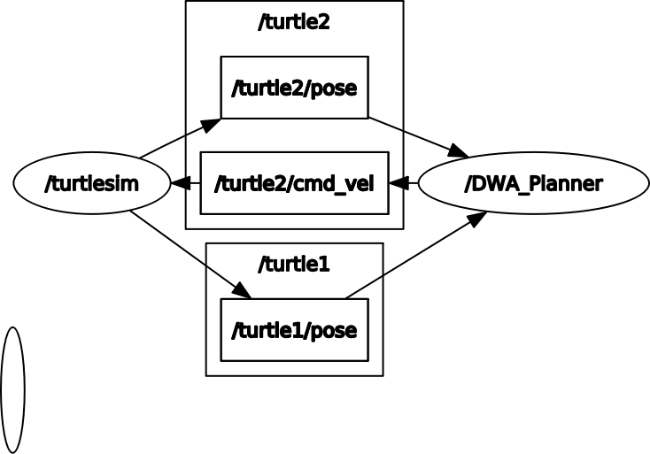

# Ros2_Project1_DWA_Pathplanning_Turtlesim
## We are going to control Turtle2 to reach each goal in order avoiding Turtle1 at the same time

---

# Version
## OS
Ubuntu 18.04 LTS
## Ros2
Ros2-Dashing

---

# Description
## Diagram

## Note
### By uncommenting  
### ( "DWA_Planner_pub1, self.timer1" in __init__,  dwa_path_planner.py and "def publish1(self)" )  
### in DWA_Planner class in dwa_path_planner.py, you can make turtle1 move as well avoiding turtle2 at the same time. However, it doesn't really work well although it does when turtle1 is fixed and only turtle2 moves. It seems like parameters should be adjusted. You can try tho!

---

# How to Use
## First, you do
    git clone https://github.com/Gonnnnn/Ros_Project.git

And then move 'dwa_pathplanning_turtlesim' to src directory under your workspace(commonly, it's ~/robot_ws)

    cd ./Ros2_Project2_DWA_Pathplanner
    mv /dwa_pathplanning_turtlesim ~/{workspace}/src

And do the following

    cd ~/{workspace}
    colcon build --symlink-install --packages-select dwa_pathplanning_turtlesim

## Run each node
Run turtlesim_node

    ros2 run turtlesim turtlesim_node

Spawn turtle2

    ros2 service call /spawn turtlesim/srv/Spawn "{x: 1.0, y: 1.0, theta: 0.0, name: 'turtle2'}"

Run DWA_Planner

    ros2 run dwa_pathplanning_turtlesim DWA_Planner

## Launch a launch file
Sry I was too lazy :)... I might make it but i'm not rly sure when i'd do it

## If it doesn't work?
welp.. :D

---

# Reference
## Naver Cafe : Open Source Robot Cafe(오로카)
7 Package and node
https://cafe.naver.com/openrt/24065

24 Python - Basic Programming
https://cafe.naver.com/openrt/24450

27 Topic interface
https://cafe.naver.com/openrt/24629

28 Python package building
https://cafe.naver.com/openrt/24637

29 Topic programming
https://cafe.naver.com/openrt/24644
